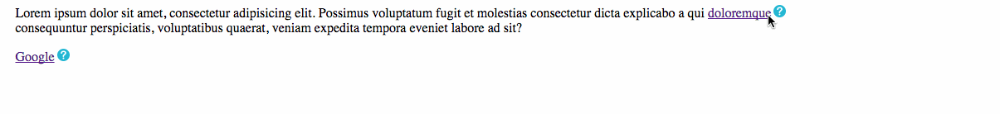
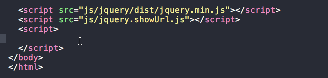
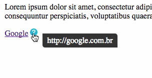
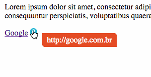
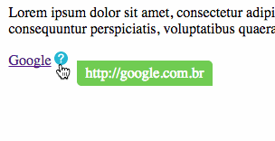
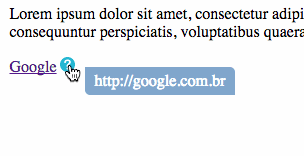

# ShowURL


Playing with jQuery and born this. A simple plugin that shows the URLs in links.

## Example


Put inside of jQuery object ```$()``` the element ```a```, or any class or id, for example: ```.myclass``` or ```myid```. 

*** Important: If you use the ```a``` element, all links will receive the icon and will show the label.



## Just three steps!

1 - Import CSS:

```html
<link rel="stylesheet" href="css/style-show-url.css">
```

2 - Import JS:

```html
	<script src="js/jquery/dist/jquery.min.js"></script>
	<script src="js/jquery.showUrl.js"></script>
```

3 - Call the Element:

```html
	<script>
		$('a').showUrl();
	</script>
```

## More

Change the background color using a simple parameter:

#### > Background Default



```html
	<script>
		$('a').showUrl();
	</script>
```

#### > Background Red



```html
	<script>
		$('a').showUrl('red');
	</script>
```

#### > Background Green



```html
	<script>
		$('a').showUrl('green');
	</script>
```

#### > Background Blue



```html
	<script>
		$('a').showUrl('blue');
	</script>
```

##### Contribute

To contribute, open a issue or fork this project and send me a PR.

For any kind of doubt, see the [DEMO](demo-show-url.html)

Thanks!